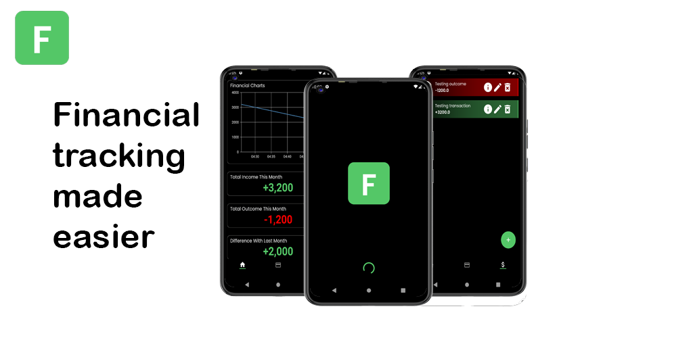

# Financial Tracker

Financial tracking made easier!
That's the biggest idea for this application. Feel free to give feedback or contribute in this project.

## Features
- Wealth tracking with graph 
- Easy transaction recording
- Recurring transaction
- Simple UI
- Free

## Design
This is the [Figma Link](https://www.figma.com/file/lGfyqRArTUS9GaKUYLk2IG/Financial-Tracker?node-id=5%3A4&t=4QKdgPx32PzzGmJ7-1). You can DM me at LinkedIn for edit access.

## Tech Stack
This app built with Flutter `3.7.7` and Dart `2.19.1`. And it's using SQLite as its database.

## Download
You can get it at [Google Play Store](https://play.google.com/store/apps/details?id=com.software_engineer_story.financial_tracker) or build it by yourself.

## Development Environment Setup
- Clone the code
- Open it with Visual Studio Code or Android Studio
- Now you can run or debug the program